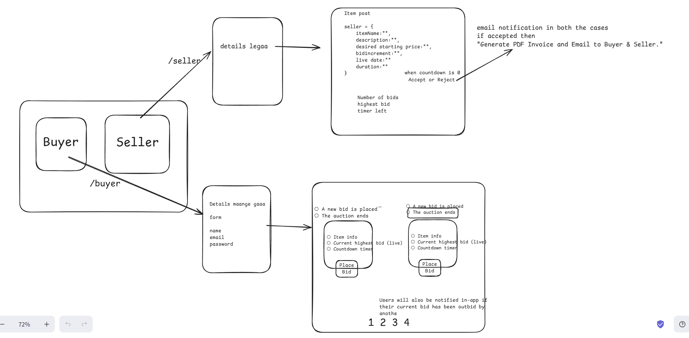

## SwiftBid || INE Assignment
Live URl: https://swift-bid.onrender.com
### System Design
Before starting the assignment, I created system design to outline the structure and workflow of the application. This provides an overview of how the application operates.

**Tech Stack:**  
- **Frontend:** React  
- **State Management:** Redux Toolkit  
- **Communication:** Socket.io  
- **Backend:** Express.js  
- **Database:** Supabase  

### Features
- Real-time updates  
- Fully deployed application  
- Email notifications sent after auction ends  
- Minimal, user-friendly UI  

### Video Demonstration (Click on the video)

